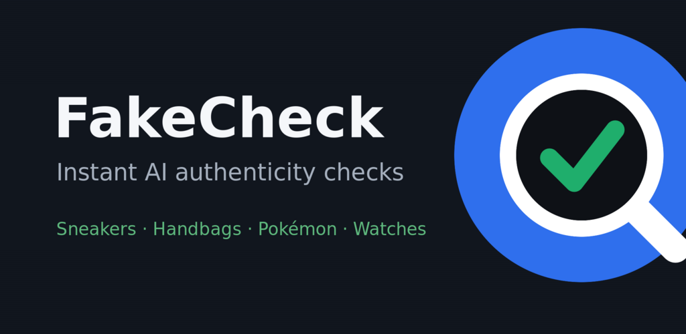
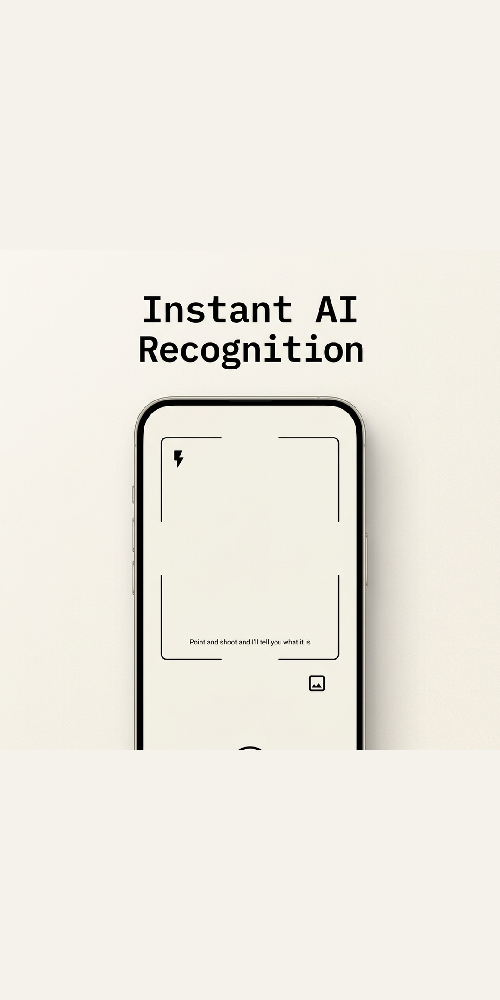
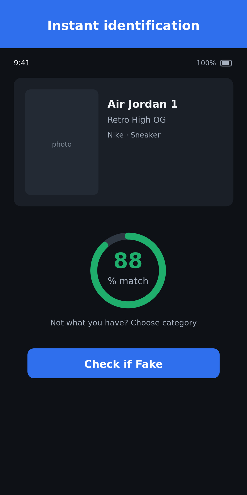
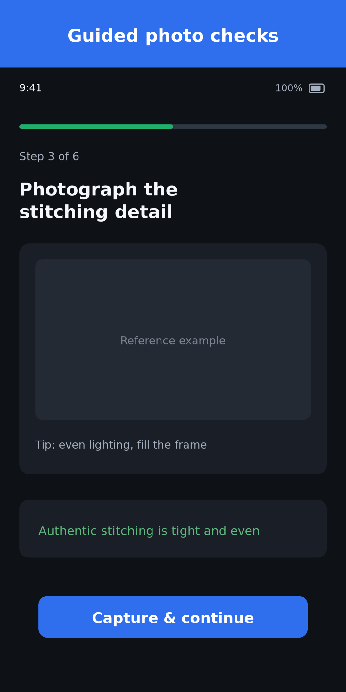
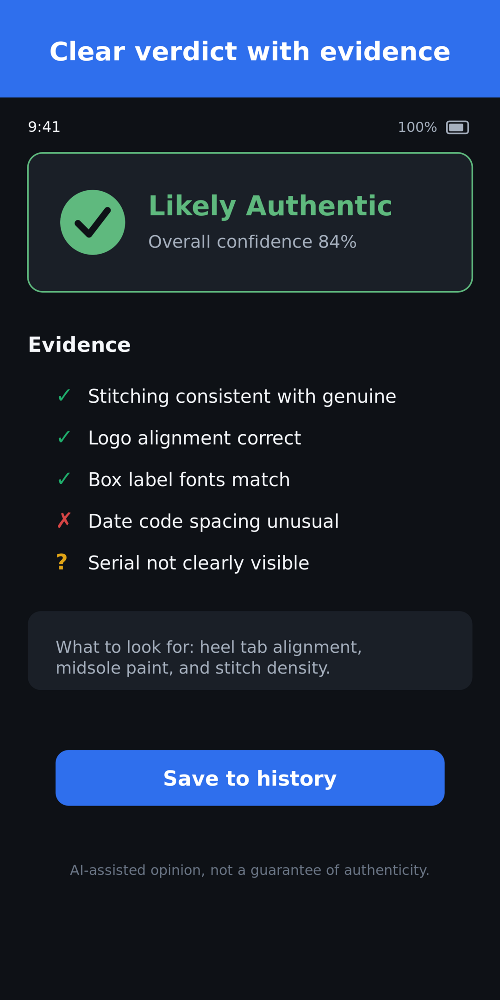

# Snap Check (powered by flossin)

<p align="center">
  
</p>

<p align="center">
  <strong>Point. Check. Know.</strong><br>
  Chic, AI-assisted authentication for sneakers, luxury handbags, Pokémon cards, and luxury watches.
</p>

---

## App Preview

<p align="center">
  
</p>

### Screenshots

<p align="center">
  
  
  
  
</p>

---

## Overview

Snap Check is a mobile-first application: point your phone at an item to instantly identify it, run guided category-specific checks (e.g. stitching, stitching lines, labels, holographic stamps, serial codes), and receive an authenticity verdict (**Authentic**, **Counterfeit**, or **Inconclusive**) with a confidence score and a transparent breakdown of findings.

**This is an AI-assisted assessment, not a certified appraisal.**

---

## Monorepo Layout

```
fakecheck/
├── backend/    # ASP.NET Core Web API on .NET 10 (layered: Api / Core / Infrastructure / Tests)
├── mobile/     # Expo SDK 56 (React Native) app
├── docs/       # spec, build plan, and the per-check prompt library (core IP)
│   └── prompts/
├── .github/workflows/   # CI (backend + mobile)
└── secrets/    # *.env.example templates (real *.env are gitignored)
```

---

## Stack (Locked)

| Layer | Choice |
|---|---|
| **Backend** | ASP.NET Core Web API, .NET 10 (LTS) |
| **Front-end** | React Native via Expo SDK 56 |
| **Vision** | Tiered — Lightweight model for identification, premium model for authenticity checks |
| **Object Storage** | Cloudflare R2 (S3-compatible) |
| **Deployment** | Railway (Docker + managed Postgres + Redis) |
| **Launch Categories** | Sneakers · Luxury Handbags · Pokémon Cards · Luxury Watches |

---

## Build Status

Progress is tracked in [`PROGRESS.md`](./PROGRESS.md). The build is executed incrementally by a scheduled agent following [`FakeCheck_Build_Instructions.md`](./FakeCheck_Build_Instructions.md).

---

## Local Development (Quick Reference)

### Backend

1. Navigate to the backend directory:
   ```bash
   cd backend
   ```
2. Start the development databases:
   ```bash
   docker compose -f docker-compose.dev.yml up -d   # Postgres + Redis
   ```
3. Run migrations and start the server:
   ```bash
   dotnet ef database update --project FakeCheck.Infrastructure --startup-project FakeCheck.Api
   dotnet run --project FakeCheck.Api                # Swagger UI available at /swagger
   ```

### Mobile Client

1. Navigate to the mobile directory:
   ```bash
   cd mobile
   ```
2. Install dependencies and start Expo Go:
   ```bash
   npm install
   npx expo start
   ```

> [!NOTE]
> Copy `secrets/backend.env.example` → `secrets/backend.env` and `secrets/mobile.env.example` → `secrets/mobile.env` and fill in credentials before running anything that requires vision APIs, R2 object storage, or the deployed backend.
